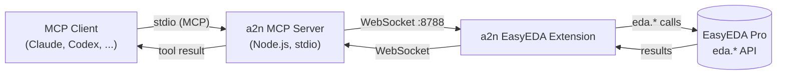
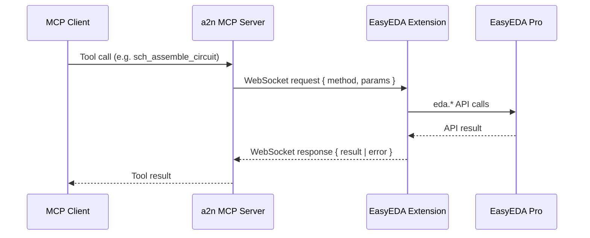
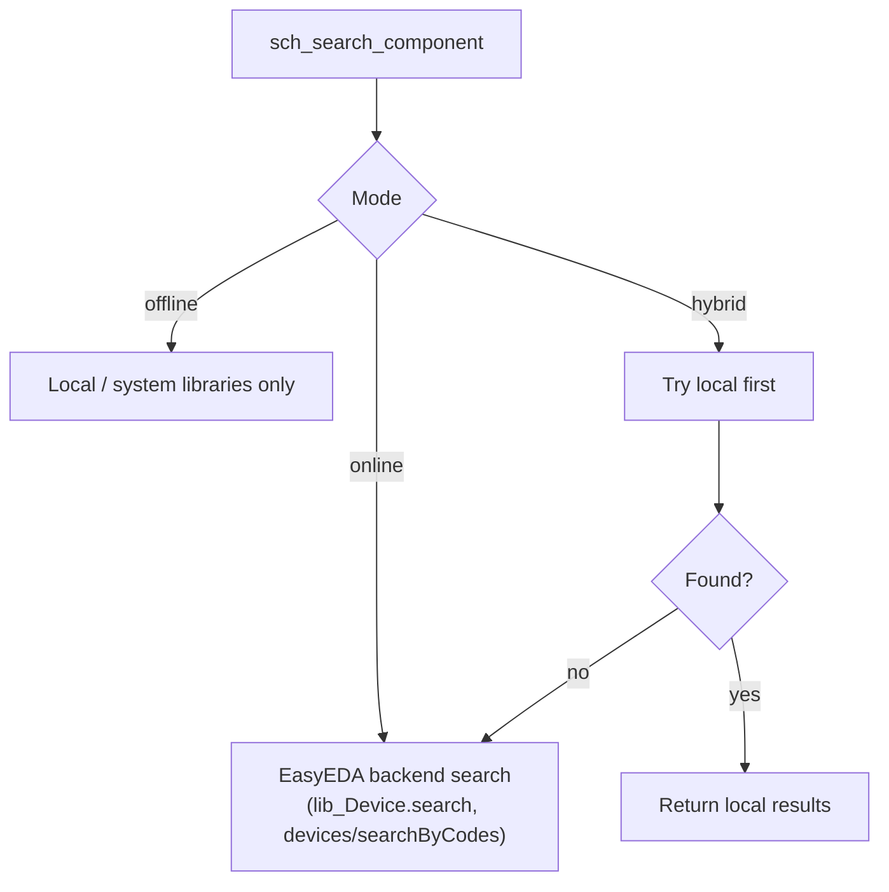
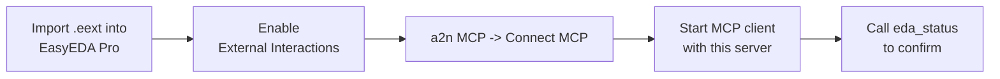

# a2n.EasyEDA MCP

Pure-interface MCP bridge for **EasyEDA Pro**. No AI, no API keys, no external server.
It exposes the EasyEDA `eda.*` API to any MCP client (Claude, Codex, and other
MCP-compatible agents) so the client's own model drives schematic/PCB automation directly.

Merged from the best of two open-source projects:

- Low-level `eda.*` coverage (PCB primitives, tracks, vias, nets, DRC, layers, pads,
  pour/fill, manufacture exports, schematic primitives) — inspired by
  `QuincySx/easyeda-agent-mcp-server`.
- High-level project/document/checkpoint handling and a **local auto-place + auto-wire
  engine** (`sch_assemble_circuit`) — inspired by `biosshot/easyeda-copilot` (server/AI
  parts removed).

## Features

- Pure interface to EasyEDA Pro — the bridge holds no model and needs no API key.
- Full low-level schematic and PCB control plus high-level circuit assembly.
- Configurable WebSocket port and `online` / `offline` / `hybrid` component sourcing.
- Self-contained MCP server (single bundled file) and a packaged `.eext` extension.

## Architecture



- **MCP server** (`src/mcp-server`): runs locally, opens a WebSocket server on a
  configurable port (default `8788`), exposes the MCP tools.
- **EasyEDA extension** (`src/extension`): connects to the WebSocket server, executes
  `eda.*` calls, returns results. Adds an `a2n MCP` menu (Connect / Disconnect /
  Configure / Status / About).

## Request flow



## Modes (online / offline / hybrid)

Configured in the extension (`a2n MCP -> Configure...`):



- **offline** — component search restricted to local/system libraries.
- **online** — component search via the EasyEDA backend. Uses your existing EasyEDA
  login; no extra API key.
- **hybrid** — local first, then online fallback (default).

## Build

```bash
npm install
npm run build      # builds the extension (dist/index.js) + MCP server (dist/mcp-server) and packages the .eext
# or just:
npm run compile    # builds without packaging the .eext
```

Outputs:

- `dist/mcp-server/index.js` — the MCP server (self-contained, runnable with Node).
- `build/dist/a2n-easyeda-mcp_v<version>.eext` — import into EasyEDA Pro
  (`Settings -> Extensions -> Extensions Manager -> Import Extensions`).

## MCP client configuration

Recommended (after publishing to npm):

```json
{
  "mcpServers": {
    "a2n-easyeda-mcp": {
      "command": "npx",
      "args": ["-y", "a2n-easyeda-mcp"]
    }
  }
}
```

Local build (without npm):

```json
{
  "mcpServers": {
    "a2n-easyeda-mcp": {
      "command": "node",
      "args": ["<abs-path>/a2n-easyeda-mcp/dist/mcp-server/index.js", "--port=8788"]
    }
  }
}
```

The default port is `8788` and matches on both sides, so `--port` is optional unless you
change it. Override with `--port=NNNN` or the `A2N_EDA_WS_PORT` environment variable.

## Usage



1. Build and import the `.eext` into EasyEDA Pro; enable "External Interactions".
2. Open a schematic/PCB, then `a2n MCP -> Connect MCP` (set the port via `Configure...`
   if you changed it).
3. Start your MCP client with this server configured, then call `eda_status` to confirm
   the connection and active mode.

The WebSocket port must match on both sides (server `--port` / `A2N_EDA_WS_PORT` and the
extension's Configure dialog).

## License

MIT. This project is a derivative work that reuses and adapts code from the MIT-licensed
projects `QuincySx/easyeda-agent-mcp-server` and `biosshot/easyeda-copilot`; their
respective copyrights are retained under the same license.
