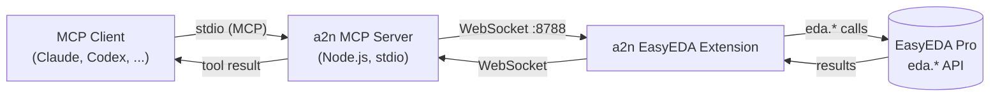
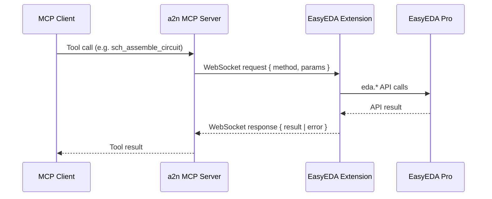
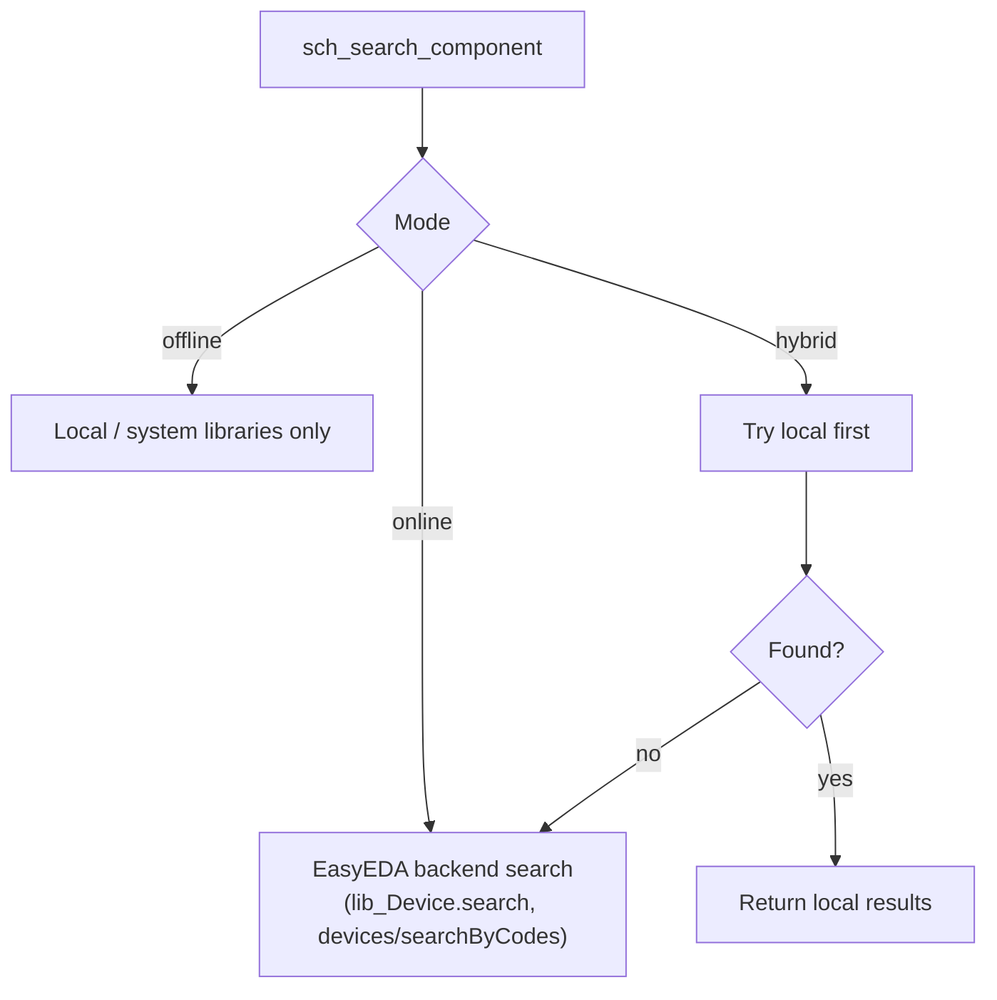
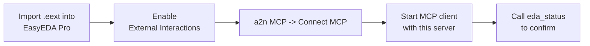

# a2n.EasyEDA MCP

Pure-interface MCP bridge for **EasyEDA Pro**. No AI, no API keys, no external server.
It exposes the EasyEDA `eda.*` API to any MCP client (Claude, Codex, and other
MCP-compatible agents) so the client's own model drives schematic/PCB automation directly.

Merged from the best of two open-source projects:

- Low-level `eda.*` coverage (PCB primitives, tracks, vias, nets, DRC, layers, pads,
  pour/fill, manufacture exports, schematic primitives) — inspired by
  `QuincySx/easyeda-agent-mcp-server`.
- High-level project/document/checkpoint handling and a **local auto-place + auto-wire
  engine** (`sch_assemble_circuit`) — inspired by `biosshot/easyeda-copilot` (server/AI
  parts removed).

## Features

- Pure interface to EasyEDA Pro — the bridge holds no model and needs no API key.
- Full low-level schematic and PCB control plus high-level circuit assembly.
- Configurable WebSocket port and `online` / `offline` / `hybrid` component sourcing.
- Self-contained MCP server (single bundled file) and a packaged `.eext` extension.

## Tools

### Common

- `eda_status`, `eda_set_mode`, `eda_get_project_info`, `eda_open_document`, `eda_guide`
- `eda_call` / `eda_exec` — generic escape hatches to invoke any registered handler or any
  `eda.*` API path directly (no extension rebuild needed for new calls).

### Schematic (`sch_*`)

- Read: `sch_get_all_components`, `sch_get_component_pins`, `sch_get_all_wires`,
  `sch_get_netlist`, `sch_read_circuit`, `sch_get_selected`, `sch_run_drc`
- `sch_validate_netlist` — read-only connectivity diagnostic: floating (unconnected) pins,
  single-pin nets (likely dangling), and a per-net summary. Computed from the resolved
  circuit; performs no write.
- `sch_export_image` — export the **full schematic sheet** as a PNG (whole A4 page: border, title
  block, and every component) with true colors, reproducing EasyEDA's "Export → PNG". It reads the
  schematic SVG via the **Chrome DevTools Protocol**, reframes to the full content, converts the
  title-block `<foreignObject>` to SVG text, and rasterizes — it is NOT a viewport screenshot.
  Requires EasyEDA Pro launched with remote debugging — use `run-easyeda-debug.bat` (or pass
  `--remote-debugging-port=9222 --disable-renderer-backgrounding --disable-backgrounding-occluded-windows
  --disable-background-timer-throttling`) — and an open schematic page. Port via `A2N_EDA_CDP_PORT`
  (default 9222), resolution via `scale` (default 2, or `A2N_EDA_CAPTURE_SCALE`). The PNG is returned
  inline; pass `fileName` to ALSO save it (absolute path, or a bare name under `A2N_EDA_CAPTURE_DIR` /
  OS temp dir).
- Search/write: `sch_search_component`, `sch_place_component`, `sch_create_wire`,
  `sch_create_netflag`, `sch_delete_components`
- High-level: `sch_assemble_circuit` (local auto-place + auto-wire by net name)
- Management: `sch_create_schematic`, `sch_create_page`, `sch_save`,
  `sch_checkpoint_save` / `sch_checkpoint_list` / `sch_checkpoint_restore`

### PCB (`pcb_*`)

- Read: `pcb_get_all_components`, `pcb_get_component_pins`, `pcb_get_all_nets`,
  `pcb_get_net_length`, `pcb_get_all_layers`, `pcb_get_selected`, `pcb_get_board_outline`
- Write: `pcb_create_track`, `pcb_create_via`, `pcb_create_pour`, `pcb_move_component`,
  `pcb_delete_primitives`, `pcb_set_copper_layers`, `pcb_highlight_net`
- Checks: `pcb_run_drc`
- Export (base64): `pcb_export_gerber`, `pcb_export_bom`, `pcb_export_pick_place`,
  `pcb_export_pdf`, `pcb_export_3d`
- `pcb_save`

## Architecture



- **MCP server** (`src/mcp-server`): runs locally, opens a WebSocket server on a
  configurable port (default `8788`), exposes the MCP tools.
- **EasyEDA extension** (`src/extension`): connects to the WebSocket server, executes
  `eda.*` calls, returns results. Adds an `a2n MCP` menu (Connect / Disconnect /
  Configure / Status / About).

## Request flow



## Modes (online / offline / hybrid)

Configured in the extension (`a2n MCP -> Configure...`):



- **offline** — component search restricted to local/system libraries.
- **online** — component search via the EasyEDA backend. Uses your existing EasyEDA
  login; no extra API key.
- **hybrid** — local first, then online fallback (default).

## Build

```bash
npm install
npm run build      # builds the extension (dist/index.js) + MCP server (dist/mcp-server) and packages the .eext
# or just:
npm run compile    # builds without packaging the .eext
```

Outputs:

- `dist/mcp-server/index.js` — the MCP server (self-contained, runnable with Node).
- `build/dist/a2n-easyeda-mcp_v<version>.eext` — import into EasyEDA Pro
  (`Settings -> Extensions -> Extensions Manager -> Import Extensions`).

## MCP client configuration

Recommended (after publishing to npm):

```json
{
  "mcpServers": {
    "a2n-easyeda-mcp": {
      "command": "npx",
      "args": ["-y", "a2n-easyeda-mcp"]
    }
  }
}
```

Local build (without npm):

```json
{
  "mcpServers": {
    "a2n-easyeda-mcp": {
      "command": "node",
      "args": ["<abs-path>/a2n-easyeda-mcp/dist/mcp-server/index.js", "--port=8788"]
    }
  }
}
```

The default port is `8788` and matches on both sides, so `--port` is optional unless you
change it. Override with `--port=NNNN` or the `A2N_EDA_WS_PORT` environment variable.

## Environment variables

All are optional; the server/extension work with the defaults below.

| Variable | Used by | Default | Purpose |
| --- | --- | --- | --- |
| `A2N_EDA_WS_PORT` | MCP server | `8788` | WebSocket bridge port (must match the extension's `Configure...` port). The `--port=NNNN` CLI flag takes precedence. |
| `A2N_EDA_CDP_PORT` | `sch_export_image` | `9222` | Chrome DevTools Protocol port EasyEDA Pro is launched with (see `run-easyeda-debug.bat`). The tool's `port` argument takes precedence. |
| `A2N_EDA_CAPTURE_SCALE` | `sch_export_image` | `2` | Rasterization scale factor (1–4). The tool's `scale` argument takes precedence. |
| `A2N_EDA_CAPTURE_DIR` | `sch_export_image` | OS temp dir | Base directory for a bare `fileName`; absolute `fileName` paths ignore this. |

## Usage



1. Build and import the `.eext` into EasyEDA Pro; enable "External Interactions".
2. Open a schematic/PCB, then `a2n MCP -> Connect MCP` (set the port via `Configure...`
   if you changed it).
3. Start your MCP client with this server configured, then call `eda_status` to confirm
   the connection and active mode.

The WebSocket port must match on both sides (server `--port` / `A2N_EDA_WS_PORT` and the
extension's Configure dialog).

## Troubleshooting

**`eda_status` fails / tools time out — bridge not connected.**
- Confirm the extension menu shows a connected state: `a2n MCP -> Status`. If not, run
  `a2n MCP -> Connect MCP`.
- Verify the ports match: the MCP server's `--port` / `A2N_EDA_WS_PORT` must equal the value in
  the extension's `Configure...` dialog (default `8788` on both sides).
- Make sure EasyEDA Pro has "External Interactions" enabled (required for the extension to open
  the WebSocket).
- Only one MCP server should own the port at a time. If the port is taken, pick another and set
  it on both sides.

**`sch_*` or `pcb_*` calls error with a context/document message.**
- `sch_*` tools require a SCHEMATIC PAGE to be the active document; `pcb_*` tools require a PCB.
- Switch with `eda_open_document` using a UUID from `eda_get_project_info`. Running a PCB op while
  a schematic is active (or vice versa) will error.

**`sch_export_image` fails: "Cannot reach EasyEDA CDP on 127.0.0.1:9222".**
- EasyEDA Pro must be launched with remote debugging. Close it, then start it via
  `run-easyeda-debug.bat` (or with `--remote-debugging-port=9222 --disable-renderer-backgrounding
  --disable-backgrounding-occluded-windows --disable-background-timer-throttling`).
- If you changed the debug port, pass it as the tool's `port` argument or set `A2N_EDA_CDP_PORT`.
- A schematic page must be open. "No active schematic sheet found" means the editor has no
  schematic frame to capture — open a page first.

**`sch_export_image` produces a blank/empty image.**
- The backgrounding flags above keep the renderer painting when EasyEDA is not the foreground
  window; without them, captures can stall or come out empty. Re-launch via the `.bat`.

**Component search returns nothing.**
- Check the active mode with `eda_status`. In `offline` mode only local/system libraries are
  searched. Use `eda_set_mode` to switch to `hybrid` (local first, then online) or `online`.
- Online search uses your existing EasyEDA login; make sure you are signed in to EasyEDA Pro.

**Extension changes don't take effect after a rebuild.**
- Re-import the freshly built `build/dist/a2n-easyeda-mcp_v<version>.eext` into EasyEDA Pro, then
  reconnect (`a2n MCP -> Disconnect MCP` then `Connect MCP`). The MCP server side just needs a
  restart of `dist/mcp-server/index.js`.

## License

MIT. This project is a derivative work that reuses and adapts code from the MIT-licensed
projects `QuincySx/easyeda-agent-mcp-server` and `biosshot/easyeda-copilot`; their
respective copyrights are retained under the same license.
